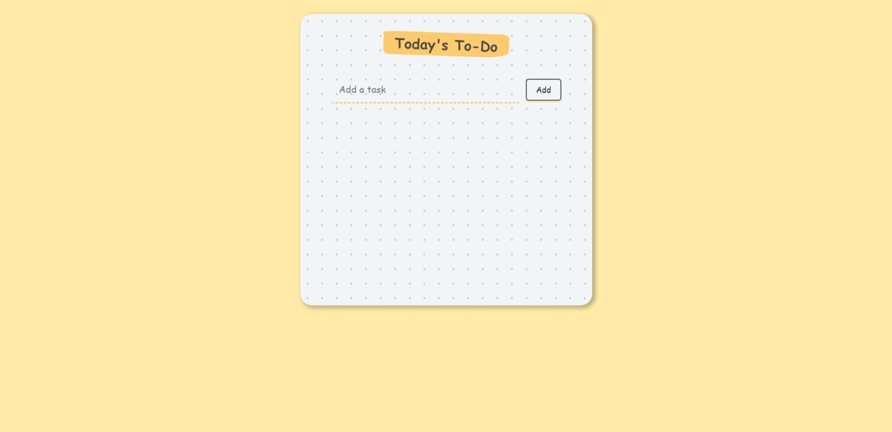

# Simple Todo List

A simple and responsive Todo List created using HTML, CSS, and JavaScript.

## Features

- Add tasks to the Todo list.

## Preview

## Getting Started

1. Clone the repository: git clone `https://github.com/vsbuidev/dailytasks.git`
2. Open the `index.html` file in your web browser.

## Usage

1. Type a task in the input box.
2. Press Enter or click the "Add" icon to add the task to the Todo list.

## Customization

Feel free to customize the styling and functionality according to your preferences. You can modify the HTML, CSS, and JavaScript files to suit your needs.

## License

This project is licensed under the [MIT License](LICENSE).

## Acknowledgments

- This project was created as a simple example for learning web development.

Happy coding!
